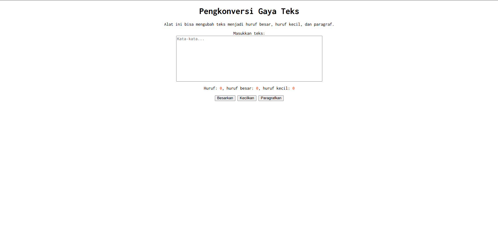

# Tugas Pendahuluan 03: GUI dengan HTML dan CSS

Nama: Rafael Putra Septava  
NIM: 103122400015  
Kelas: SE0801  

## Tugas

Buatlah tata letak laman yang kamu buat berada di tengah seperti di bawah ini, dan juga ubah font-nya dengan Inconsolata dari Google Fonts.

## Program/Kode

tersedia di [index.html](https://github.com/RafaelSeptava/KPL_RafaelPutraSeptava_103122400015_SE0801/blob/main/03_GUI_dengan_HTML_dan_CSS/TP/index.html), [index.css](https://github.com/RafaelSeptava/KPL_RafaelPutraSeptava_103122400015_SE0801/blob/main/03_GUI_dengan_HTML_dan_CSS/TP/index.css), [index.js](https://github.com/RafaelSeptava/KPL_RafaelPutraSeptava_103122400015_SE0801/blob/main/03_GUI_dengan_HTML_dan_CSS/TP/index.js)

## Output

## Deskripsi 

Program ini menampilkan laman Pengkonversi Gaya Teks menggunakan HTML, CSS, dan JavaScript.