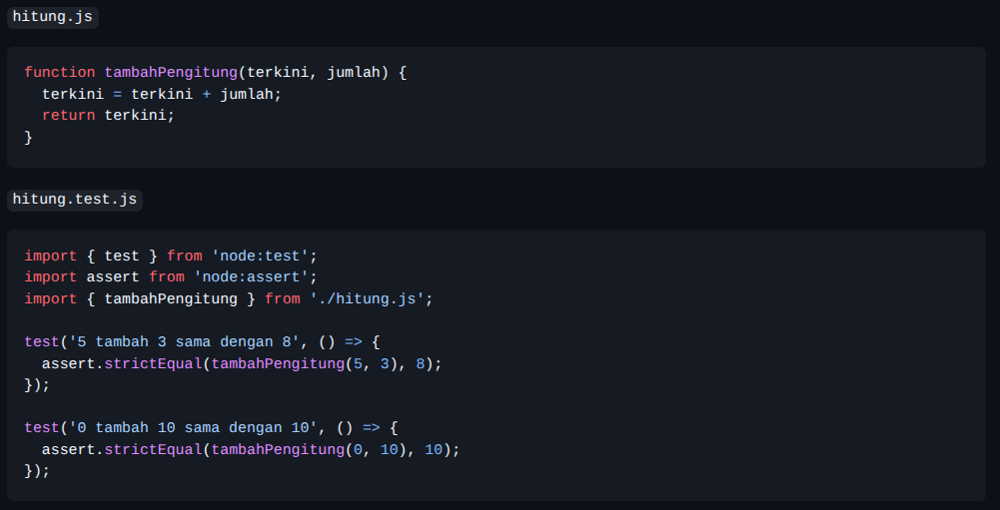

# Tugas Mandiri 12: Performance Analysis, Unit Testing, dan Debugging

Nama : Rafael Putra Septava  
NIM  : 103122400015  
Kelas: SE0801  

## Tugas

Tambah dan tambah!

Fungsi di bawah ini melakukan penjumlaha pada penghitung (counter), yang sesederhana menambahk jumlah jika kamu menekan tombol.

Bisakah kamu tunjukkan apakah kode sudah benar atau bagian mana yang perlu diperbaiki beserta alasannya?

## Program/Kode

tersedia di [hitung.js](https://github.com/RafaelSeptava/KPL_RafaelPutraSeptava_103122400015_SE0801/blob/main/12_Performance_Analysis_Unit_Testing_dan_Debugging/TM_12/hitung.js), [hitung_test.js](https://github.com/RafaelSeptava/KPL_RafaelPutraSeptava_103122400015_SE0801/blob/main/12_Performance_Analysis_Unit_Testing_dan_Debugging/TM_12/hitung_test.js)

## Output

## Deskripsi

Kode program tersebut belum sepenuhnya benar, dikarenakan pada file hitung.js, tidak ada export pada function tambahPenghitung, sedangkan pada bagian hitung_test.js, terdapat import { tambahPengitung } from './hitung.js'.  

Bagian yang perlu diperbaiki adalah menambahkan export di depan function tambahPenghitung supaya import { tambahPenghitung } dapat mendeteksi adanya export function tambahPenghitung.  
Bagian kedua yang perlu diperbaiki adalah gaya penulisan pada variabel di file hitung.js, tepatnya pada variabel 'terkini = terkini + jumlah'. Supaya lebih ringkas lebih baik dibuat menjadi return 'terkini + jumlah'. Dikarenakan variabel 'terkini' tidak perlu diubah dulu sebelum dikembalikan.