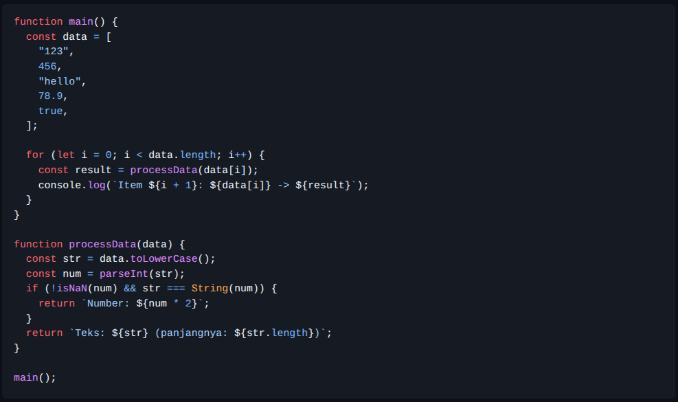

# Tugas Pendahuluan 12: Performance Analysis, Unit Testing, dan Debugging

Nama : Rafael Putra Septava  
NIM  : 103122400015  
Kelas: SE0801  

## Tugas

Cobalah untuk menangkap kecacatan dalam kode ini

## Program/Kode

tersedia di [index.js](https://github.com/RafaelSeptava/KPL_RafaelPutraSeptava_103122400015_SE0801/blob/main/12_Performance_Analysis_Unit_Testing_dan_Debugging/TP_12/index.js)

## Output

## Deskripsi

Masalah yang saya temukan dalam program tersebut di soal adalah toLowerCase() hanya bisa digunakan untuk tipe data string, sedangkan isi dalam const data isinya campur. sehingga ketika loop sudah mencapai 456, maka program akan crash. Kesalahan selanjutnya berada pada parseInt() yang memotong angka desimal yaitu 78.9 menjadi 78. Kesalahan selanjutnya adalah pemeriksaan angka terlalu ketat seperti contohnya str === String(num). Kesalahan selanjutnya adalah boolean diperlakukan seperti string.  

Maka cara memperbaikinya adalah menggunakan typeof agar program tahu tipe data sebelum memproses. Lalu menghindari error toLowerCase is not a functon. Mengganti parseInt() dengan Number() supaya angka desimal tetap benar. lalu menambahkan penanganan untuk boolean.